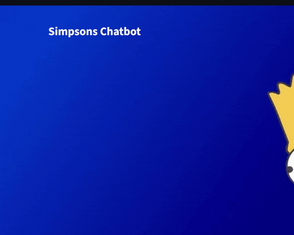

# Simpsons Chatbot

This repository contains a Streamlit-based chatbot that uses a fine-tuned Large Language Model (LLM) to respond in the style of Homer Simpson. Users can interact as Bart Simpson or other characters, and the chatbot will reply accordingly.



## Features

- Chatbot interface built with Streamlit
- Custom avatars for user (Bart) and assistant (Homer)
- Messages styled for clear distinction between user and assistant
- LLM backend powered by [llama.cpp](https://github.com/abetlen/llama-cpp-python)
- Easily switch between characters for both user and assistant
- Fine-tuning and inference scripts included

## Dataset

The chatbot is trained on conversations between Bart and Homer Simpson:
- [Bart & Homer Simpson Conversations Dataset](https://huggingface.co/datasets/OscarIsmael47/Bart_Simpson_and_Homer_Simpson_conversations)
- Local file: `data/simpsons_dataset.csv`

### Creating the Dataset

You can generate your own conversation dataset using the script in `utils/create_simpsons_dataset.py`.  
This script processes the original Simpsons dialogue CSV, extracts conversations between Bart and Homer, and formats them for LLM fine-tuning.

**Steps:**
1. Place your raw Simpsons dialogue CSV as `data/simpsons_dataset.csv`.
2. Run the script:
   ```sh
   python utils/create_simpsons_dataset.py
   ```
3. The script will output a JSON file with conversation pairs and optionally push the dataset to Hugging Face Hub.

See comments in `utils/create_simpsons_dataset.py` for customization options (e.g., filtering characters, changing output format).

## Model

The chatbot uses a fine-tuned Llama 3.1 model specifically adapted for Bart and Homer Simpson conversations.  
Download the model here:  
- [Meta-Llama-3.1-8B-q4_k_m-Bart_Simpson_and_Homer_Simpson-GGUF](https://huggingface.co/OscarIsmael47/Meta-Llama-3.1-8B-q4_k_m-Bart_Simpson_and_Homer_Simpson-GGUF)

Place the downloaded `.gguf` file in the `models/` directory (default: `models/bart_homer.gguf`) before running the app.

## Getting Started

1. **Clone the repository**
   ```sh
   git clone https://github.com/yourusername/simpsons_chatbot.git
   cd simpsons_chatbot
   ```

2. **Install dependencies**
   ```sh
   pip install -r requirements.txt
   ```

3. **Download the model**
   - Place the GGUF model file in the `models/` directory (default: `models/bart_homer.gguf`).

4. **Run the app**
   ```sh
   streamlit run app.py
   ```

## File Structure

- `app.py` — Streamlit UI and chat logic
- `utils/llm_helper.py` — LLM wrapper for chat completion ([llm_helper.py](utils/llm_helper.py))
- `utils/create_simpsons_dataset.py` — Script to generate conversation datasets
- `data/simpsons_dataset.csv` — Raw training data
- `models/` — GGUF model files
- `notebooks/conversation_finetuning.ipynb` — Notebook for model fine-tuning
- `notebooks/Modelfile` — Ollama/llama.cpp chat template

## Fine-tuning

- See [`notebooks/conversation_finetuning.ipynb`](notebooks/conversation_finetuning.ipynb) for the full fine-tuning workflow using [Unsloth](https://github.com/unslothai/unsloth) and exporting to GGUF.
- The notebook demonstrates how to prepare the dataset, train the model efficiently with Unsloth, and convert the resulting model to GGUF format for use with llama.cpp.
- The `Modelfile` in the `notebooks/` folder contains the chat template for use with Ollama or llama.cpp.

## Customization

- To add more characters, update the avatars and modify the chat logic in `app.py`.
- You can fine-tune your own models using the provided dataset and notebook.

## References

- [How to Fine-tune LLMs with Unsloth: Complete Guide](https://www.youtube.com/watch?v=Lt7KrFMcCis&t=3841s)
- [Unsloth: Fast LLM Fine-tuning](https://github.com/unslothai/unsloth)
- [llama.cpp Python bindings](https://github.com/abetlen/llama-cpp-python)
